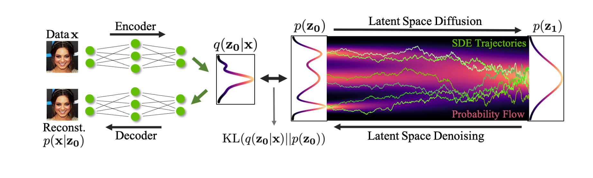

[](https://paperswithcode.com/sota/image-generation-on-cifar-10?p=score-based-generative-modeling-in-latent) [](https://paperswithcode.com/sota/image-generation-on-celeba-hq-256x256?p=score-based-generative-modeling-in-latent)
# The Official PyTorch Implementation of "LSGM: Score-based Generative Modeling in Latent Space" [(NeurIPS 2021)](https://arxiv.org/abs/2106.05931)

<div align="center">
  <a href="http://latentspace.cc/arash_vahdat/" target="_blank">Arash&nbsp;Vahdat*</a> &emsp; <b>&middot;</b> &emsp;
  <a href="https://karstenkreis.github.io/" target="_blank">Karsten&nbsp;Kreis*</a> &emsp; <b>&middot;</b> &emsp;
  <a href="http://jankautz.com/" target="_blank">Jan&nbsp;Kautz</a> <br> <br>
  (*equal contribution) <br> <br>
  <a href="https://nvlabs.github.io/LSGM/" target="_blank">Project&nbsp;Page</a>
</div>
<br>
<br>

[LSGM](https://arxiv.org/abs/2106.05931) trains a score-based generative model (a.k.a. a denoising diffusion model)
in the latent space of a variational autoencoder. It currently achieves state-of-the-art generative performance on several image
datasets.  

<p align="center">
    
</p>

## Requirements
LSGM is built in Python 3.8 using PyTorch 1.8.0. Please use the following command to install the requirements:
```
pip install -r requirements.txt
``` 

Optionally, you can also install [NVIDIA Apex](https://github.com/NVIDIA/apex). When apex is installed, our training scripts use the Adam optimizer from this library, which is faster than Pytorch's native Adam. 

## Set up file paths and data
This work builds on top of our previous work [NVAE](https://github.com/NVlabs/NVAE). Please follow the instructions in the 
NVAE repository to prepare your data for training and evaluation. Small datasets such as CIFAR-10, MNIST, and OMNIGLOT
do not require any data preparation as they will be downloaded automatically. Below, `$DATA_DIR` indicates
the path to a data directory that will contain all the datasets.
`$CHECKPOINT_DIR` is a directory used for storing checkpoints, and `$EXPR_ID` is a unique ID for the experiment.
`$IP_ADDR` is the IP address of the machine that will host the process with rank 0 during training
(see [here](https://pytorch.org/tutorials/intermediate/dist_tuto.html#initialization-methods)). 
`$NODE_RANK` is the index of each node among all the nodes that are running the job
(setting `$IP_ADDR`  and `$NODE_RANK` is only required for multi-node training).
`$FID_STATS_DIR` is a directory containing the FID statistics computed on each dataset (see below).

## Precomputing feature statistics on each dataset for FID evaluation

You can use the following command to compute FID statistics on the CIFAR-10 dataset as an example:
```shell script
python scripts/precompute_fid_statistics.py --data $DATA_DIR/cifar10 --dataset cifar10 --fid_dir $FID_STATS_DIR
```
which will save the FID related statistics in a directory under `$FID_STATS_DIR`. For other datasets, simply change
`--data` and `--dataset` accordingly.


## Training and evaluation
Training LSGM is often done in two stages. In the first stage, we train our VAE backbone assuming that the prior is
a standard Normal distribution. In the second stage, we swap the standard Normal prior with a score-based prior and
we jointly train both the VAE backbone and the score-based prior in an end-to-end fashion. Please check Appendix G in
our paper for implementation details. Below, we provide commands used for both stages. If for any reason your training 
is stopped, use the exact same commend with the addition of `--cont_training` to continue training from the last 
saved checkpoint. If you observe NaN, continuing the training using this flag will usually not fix the NaN issue.

<details><summary>CIFAR-10</summary>

We train 3 different VAEs with the following commands (see Table 7 in the paper).

- 20 group NVAE with full KL annealing for the "balanced" model (using 8 16GB V100 GPUs):

```shell script
python train_vae.py --data $DATA_DIR/cifar10 --root $CHECKPOINT_DIR --save $EXPR_ID/vae1 --dataset cifar10 \
    --num_channels_enc 128 --num_channels_dec 128 --num_postprocess_cells 2 --num_preprocess_cells 2 \
    --num_latent_scales 1 --num_cell_per_cond_enc 2 --num_cell_per_cond_dec 2 --num_preprocess_blocks 1 \
    --num_postprocess_blocks 1 --num_latent_per_group 9 --num_groups_per_scale 20 --epochs 600 --batch_size 32 \
    --weight_decay_norm 1e-2 --num_nf 0 --kl_anneal_portion 0.5 --kl_max_coeff 1.0 --channel_mult 1 2 --seed 1 \
    --arch_instance res_bnswish --num_process_per_node 8 --use_se
```

- 20 group NVAE with partial KL annealing for the model with best FID (using 8 16GB V100 GPUs):

```shell script
python train_vae.py --data $DATA_DIR/cifar10 --root $CHECKPOINT_DIR --save $EXPR_ID/vae2 --dataset cifar10 \
    --num_channels_enc 128 --num_channels_dec 128 --num_postprocess_cells 2 --num_preprocess_cells 2 \
    --num_latent_scales 1 --num_cell_per_cond_enc 2 --num_cell_per_cond_dec 2 --num_preprocess_blocks 1 \
    --num_postprocess_blocks 1 --num_latent_per_group 9 --num_groups_per_scale 20 --epochs 400 --batch_size 32 \
    --weight_decay_norm 1e-2 --num_nf 0 --kl_anneal_portion 1.0 --kl_max_coeff 0.7 --channel_mult 1 2 --seed 1 \
    --arch_instance res_bnswish --num_process_per_node 8 --use_se
```

- 4 group NVAE with partial KL annealing for the model with best NLL (using 4 16GB V100 GPUs):

```shell script
python train_vae.py --data $DATA_DIR/cifar10 --root $CHECKPOINT_DIR --save $EXPR_ID/vae3 --dataset cifar10 \
    --num_channels_enc 256 --num_channels_dec 256 --num_postprocess_cells 3 --num_preprocess_cells 3 \
    --num_latent_scales 1 --num_cell_per_cond_enc 3 --num_cell_per_cond_dec 3 --num_preprocess_blocks 1 \
    --num_postprocess_blocks 1 --num_latent_per_group 45 --num_groups_per_scale 4 --epochs 400 --batch_size 64 \
    --weight_decay_norm 1e-2 --num_nf 2 --kl_anneal_portion 1.0 --kl_max_coeff 0.7 --channel_mult 1 2 --seed 1 \
    --arch_instance res_bnswish --num_process_per_node 4 --use_se
```

With the resulting VAE checkpoints, we can train the three different LSGMs. The models are trained with the following 
commands on 2 nodes with 8 32GB V100 GPUs each.

- LSGM (balanced):

```shell script
mpirun --allow-run-as-root -np 2 -npernode 1 bash -c 
    'python train_vada.py --fid_dir $FID_STATS_DIR --data $DATA_DIR/cifar10 --root $CHECKPOINT_DIR \
    --save $EXPR_ID/lsgm1 --vae_checkpoint $EXPR_ID/vae1/checkpoint.pt --train_vae --custom_conv_dae --apply_sqrt2_res \
    --fir --dae_arch ncsnpp --embedding_scale 1000 --dataset cifar10 --learning_rate_dae 1e-4 \
    --learning_rate_min_dae 1e-4 --epochs 1875 --dropout 0.2 --batch_size 16 --num_channels_dae 512 --num_scales_dae 3 \
    --num_cell_per_scale_dae 8 --sde_type vpsde --beta_start 0.1 --beta_end 20.0 --sigma2_0 0.0 \
    --weight_decay_norm_dae 1e-2 --weight_decay_norm_vae 1e-2 --time_eps 0.01 --train_ode_eps 1e-6 --eval_ode_eps 1e-6 \
    --train_ode_solver_tol 1e-5 --eval_ode_solver_tol 1e-5 --iw_sample_p drop_all_iw --iw_sample_q reweight_p_samples \
    --arch_instance_dae res_ho_attn --num_process_per_node 8 --use_se --node_rank $NODE_RANK --num_proc_node 2 \
    --master_address $IP_ADDR '
```

- LSGM (best FID):

```shell script
mpirun --allow-run-as-root -np 2 -npernode 1 bash -c 
    'python train_vada.py --fid_dir $FID_STATS_DIR --data $DATA_DIR/cifar10 --root $CHECKPOINT_DIR \
    --save $EXPR_ID/lsgm2 --vae_checkpoint $EXPR_ID/vae2/checkpoint.pt --train_vae --custom_conv_dae --apply_sqrt2_res \
    --fir --cont_kl_anneal --dae_arch ncsnpp --embedding_scale 1000 --dataset cifar10 --learning_rate_dae 1e-4 \
    --learning_rate_min_dae 1e-4 --epochs 1875 --dropout 0.2 --batch_size 16 --num_channels_dae 512 --num_scales_dae 3 \
    --num_cell_per_scale_dae 8 --sde_type vpsde --beta_start 0.1 --beta_end 20.0 --sigma2_0 0.0 \
    --weight_decay_norm_dae 1e-2 --weight_decay_norm_vae 1e-2 --time_eps 0.01 --train_ode_eps 1e-6 --eval_ode_eps 1e-6 \
    --train_ode_solver_tol 1e-5 --eval_ode_solver_tol 1e-5 --iw_sample_p drop_all_iw --iw_sample_q reweight_p_samples \
    --arch_instance_dae res_ho_attn --num_process_per_node 8 --use_se --node_rank $NODE_RANK --num_proc_node 2 \
    --master_address $IP_ADDR '
```

- LSGM (best NLL):

```shell script
mpirun --allow-run-as-root -np 2 -npernode 1 bash -c 
    'python train_vada.py --fid_dir $FID_STATS_DIR --data $DATA_DIR/cifar10 --root $CHECKPOINT_DIR \
    --save $EXPR_ID/lsgm3 --vae_checkpoint $EXPR_ID/vae3/checkpoint.pt --train_vae --apply_sqrt2_res --fir \
    --cont_kl_anneal --dae_arch ncsnpp --embedding_scale 1000 --dataset cifar10 --learning_rate_dae 1e-4 \
    --learning_rate_min_dae 1e-4 --epochs 1875 --dropout 0.2 --batch_size 16 --num_channels_dae 512 --num_scales_dae 3 \
    --num_cell_per_scale_dae 8 --sde_type geometric_sde --sigma2_min 3e-5 --sigma2_max 0.999 --sigma2_0 3e-5 \
    --weight_decay_norm_dae 1e-2 --weight_decay_norm_vae 1e-2 --time_eps 0.0 --train_ode_eps 1e-6 --eval_ode_eps 1e-6 \
    --train_ode_solver_tol 1e-5 --eval_ode_solver_tol 1e-5 --iw_sample_p ll_uniform --iw_sample_q reweight_p_samples \
    --arch_instance_dae res_ho_attn --num_process_per_node 8 --use_se --node_rank $NODE_RANK --num_proc_node 2 \
    --master_address \${NGC_MASTER_ADDR} '
```

The following command can be used to evaluate the negative variational bound on the data log-likelihood as well as the FID score for 
any of the LSGMs trained on CIFAR-10 (on 2 nodes with 8 32GB V100 GPUs each):
```shell script
mpirun --allow-run-as-root -np 2 -npernode 1 bash -c 
    'python evaluate_vada.py --data $DATA_DIR/cifar10 --root $CHECKPOINT_DIR --save $EXPR_ID/eval --eval_mode evaluate \
    --checkpoint $CHECKPOINT_DIR/EXPR_ID/lsgm/checkpoint.pt --fid_dir $FID_STATS_DIR --num_process_per_node 8 \
    --nll_ode_eval --fid_ode_eval --ode_eps 1e-6 --ode_solver_tol 1e-5 --batch_size 32 --node_rank $NODE_RANK \
    --num_proc_node 2 --master_address \${NGC_MASTER_ADDR} '
```

</details>


<details><summary>MNIST</summary>

We train the NVAE component using the following command on 2 16GB V100 GPUs:
```shell script
python train_vae.py --data $DATA_DIR/mnist --root $CHECKPOINT_DIR --save $EXPR_ID/vae --dataset mnist \
      --batch_size 100 --epochs 200 --num_latent_scales 1 --num_groups_per_scale 2 --num_postprocess_cells 3 \
      --num_preprocess_cells 3 --num_cell_per_cond_enc 1 --num_cell_per_cond_dec 1 --num_latent_per_group 20 \
      --num_preprocess_blocks 2 --num_postprocess_blocks 2 --weight_decay_norm 1e-2 --num_channels_enc 64 \
      --num_channels_dec 64 --decoder_dist bin --kl_anneal_portion 1.0 --kl_max_coeff 0.7 --channel_mult 1 2 2 \
      --num_nf 0 --arch_instance res_mbconv --num_process_per_node 2 --use_se
```

We train LSGM using the following command on 4 16GB V100 GPUs:
```shell script
python train_vada.py --data $DATA_DIR/mnist --root $CHECKPOINT_DIR --save $EXPR_ID/lsgm --dataset mnist --epochs 800 \
        --dropout 0.2 --batch_size 32 --num_scales_dae 2 --weight_decay_norm_vae 1e-2 \
        --weight_decay_norm_dae 0. --num_channels_dae 256 --train_vae  --num_cell_per_scale_dae 8 \
        --learning_rate_dae 3e-4 --learning_rate_min_dae 3e-4 --train_ode_solver_tol 1e-5 --cont_kl_anneal  \
        --sde_type vpsde --iw_sample_p ll_iw --num_process_per_node 4 --use_se \
        --vae_checkpoint $CHECKPOINT_DIR/EXPR_ID/vae/checkpoint.pt  --dae_arch ncsnpp --embedding_scale 1000 \
        --mixing_logit_init -6 --warmup_epochs 20 --drop_inactive_var --skip_final_eval --fid_dir $FID_STATS_DIR
```

To evaluate the negative variational bound on the data log-likelihood on 4 16GB V100 GPUs the following command can be used:
```shell script
python evaluate_vada.py --data $DATA_DIR/mnist --root $CHECKPOINT_DIR --save $EXPR_ID/eval --eval_mode evaluate \
        --checkpoint $CHECKPOINT_DIR/EXPR_ID/lsgm/checkpoint.pt --num_process_per_node 4 --nll_ode_eval \
        --ode_eps 1e-5 --ode_solver_tol 1e-5 --batch_size 128
```

</details>

<details><summary>OMNIGLOT</summary>

We train the NVAE component using the following command on 2 16GB V100 GPUs.
```shell script
python train_vae.py --data $DATA_DIR/omniglot --root $CHECKPOINT_DIR --save $EXPR_ID/vae --dataset omniglot \
      --batch_size 64 --epochs 200 --num_latent_scales 1 --num_groups_per_scale 3 --num_postprocess_cells 2 \
      --num_preprocess_cells 2 --num_cell_per_cond_enc 3 --num_cell_per_cond_dec 3 --num_latent_per_group 20 \
      --num_preprocess_blocks 1 --num_postprocess_blocks 1 --num_channels_enc 64 --num_channels_dec 64 \
      --weight_decay_norm 1e-2 --decoder_dist bin --kl_anneal_portion 1.0 --kl_max_coeff 1.0 --channel_mult 1 2 \
      --num_nf 0 --arch_instance res_mbconv --num_process_per_node 2 --use_se
```

We train LSGM using the following command on 4 16GB V100 GPUs.
```shell script
python train_vada.py --data $DATA_DIR/omniglot --root $CHECKPOINT_DIR --save $EXPR_ID/lsgm --dataset omniglot --epochs 1500 \
        --dropout 0.2 --batch_size 32 --num_channels_dae 256 --num_scales_dae 3 --weight_decay_norm_vae 1e-2 \
        --weight_decay_norm_dae 1e-3 --train_vae  --num_cell_per_scale_dae 8 --learning_rate_dae 3e-4 \
        --learning_rate_min_dae 3e-4 --train_ode_solver_tol 1e-5 --cont_kl_anneal  --sde_type vpsde \
        --iw_sample_p ll_iw --num_process_per_node 4 --use_se \
        --vae_checkpoint $EXPR_ID/vae/checkpoint.pt  --dae_arch ncsnpp --embedding_scale 1000 --mixing_logit_init -6 \
        --warmup_epochs 20 --drop_inactive_var --skip_final_eval --fid_dir $FID_STATS_DIR
```

To evaluate the negative variational bound on the data log-likelihood on 4 16GB V100 GPUs the following command can be used:
```shell script
python evaluate_vada.py --data $DATA_DIR/omniglot --root $CHECKPOINT_DIR --save $EXPR_ID/eval --eval_mode evaluate \
        --checkpoint $CHECKPOINT_DIR/EXPR_ID/lsgm/checkpoint.pt --num_process_per_node 4 --nll_ode_eval \
        --ode_eps 1e-5 --ode_solver_tol 1e-5 --batch_size 128
```

</details>

<details><summary>CelebA-HQ-256 Quantitative Model</summary>

We train the NVAE component using the following command on 2 nodes, each with 8 32GB V100 GPUs:
```shell script
mpirun --allow-run-as-root  -np 2 -npernode 1 bash -c \
    'python train_vae.py --data $DATA_DIR/celeba/celeba-lmdb --root $CHECKPOINT_DIR --save $EXPR_ID/vae --dataset celeba_256 \
    --num_channels_enc 64 --num_channels_dec 64 --epochs 200 --num_postprocess_cells 2 --num_preprocess_cells 2 \
    --num_latent_per_group 20 --num_cell_per_cond_enc 2 --num_cell_per_cond_dec 2 --num_preprocess_blocks 1 \
    --num_postprocess_blocks 1 --weight_decay_norm 3e-2 --num_latent_scales 3 --num_groups_per_scale 8 --num_nf 2 \
    --batch_size 4 --kl_anneal_portion 1. --kl_max_coeff 1. --channel_mult 1 1 2 4 --num_x_bits 5 --decoder_dist dml \
    --progressive_input_vae input_skip --arch_instance res_mbconv --num_process_per_node 8 --use_se \
    --node_rank $NODE_RANK --num_proc_node 2 --master_address $IP_ADDR '
```

We train the LSGM using the following command on 2 nodes, each with 8 32GB V100 GPUs:
```shell script
mpirun --allow-run-as-root  -np 2 -npernode 1 bash -c \
    'python train_vada.py --data $DATA_DIR/celeba/celeba-lmdb --root $CHECKPOINT_DIR --save $EXPR_ID/lsgm --dataset celeba_256 \
    --epochs 1000 --dropout 0.2 --num_channels_dae 256 --num_scales_dae 4 --train_vae  --weight_decay_norm_vae 1e-1 \
    --weight_decay_norm_dae 1e-2 --fir  --num_cell_per_scale_dae 8 --learning_rate_dae 1e-4 --learning_rate_min_dae 1e-4 \
    --batch_size 4 --sde_type vpsde --iw_sample_p drop_sigma2t_iw --iw_sample_q ll_iw --disjoint_training \
    --num_process_per_node 8 --use_se --vae_checkpoint $EXPR_ID/vae/checkpoint.pt  --dae_arch ncsnpp \
    --embedding_scale 1000 --mixing_logit_init -6 --warmup_epochs 20 --drop_inactive_var --skip_final_eval \
    --fid_dir $FID_STATS_DIR --node_rank $NODE_RANK --num_proc_node 2 --master_address $IP_ADDR '
```

To evaluate the negative variational bound on the data log-likelihood, we use the following command on similarly 2 nodes:
```shell script
mpirun --allow-run-as-root -np 2 -npernode 1 bash -c \
    'python evaluate_vada.py  --data $DATA_DIR/celeba/celeba-lmdb --root $CHECKPOINT_DIR --save $EXPR_ID/eval_nll \
     --checkpoint $CHECKPOINT_DIR/EXPR_ID/lsgm/checkpoint_fid.pt --num_process_per_node 8 --eval_mode evaluate \
     --nll_ode_eval --ode_eps 1e-5 --ode_solver_tol 1e-5 --batch_size 64 \
     --fid_dir $FID_STATS_DIR --node_rank $NODE_RANK --num_proc_node 2 --master_address $IP_ADDR '
```

And, to evaluate the FID score, we use the following command on similarly 2 nodes:
```shell script
mpirun --allow-run-as-root -np 2 -npernode 1 bash -c \
    'python evaluate_vada.py  --data $DATA_DIR/celeba/celeba-lmdb --root $CHECKPOINT_DIR --save $EXPR_ID/eval_fid \
     --checkpoint $CHECKPOINT_DIR/EXPR_ID/lsgm/checkpoint_fid.pt --num_process_per_node 8 --eval_mode evaluate \
     --fid_ode_eval --ode_eps 1e-5 --ode_solver_tol 1e-2 --batch_size 64 --vae_train_mode \
     --fid_dir $FID_STATS_DIR --node_rank $NODE_RANK --num_proc_node 2 --master_address $IP_ADDR '
```
Note that for the FID evaluation on this model, we observed that `--ode_solver_tol 1e-5` gives a slightly worse FID score 
with much slower sampling speed (see Fig. 4 in the paper).

</details>

<details><summary>CelebA-HQ-256 Qualitative Model</summary>

We trained the qualitative model on the CelebA-HQ-256 dataset in 3 stages. In the first stage, we only trained the NVAE
component, and in the second stage, we trained an LSGM (i.e., both the NVAE backbone and the SGM prior jointly)
with the geometric VPSDE for likelihood weighting, similar to
our other models. However, in the third stage, we discarded the SGM prior model and re-trained a new SGM prior with the 
reweighted objective. In this stage, we only trained the SGM prior and left the NVAE component fixed from the second
stage.

We train the NVAE component using the following command on 2 nodes, each with 8 32GB V100 GPUs:
```shell script
mpirun --allow-run-as-root  -np 2 -npernode 1 bash -c \
    'python train_vae.py --data $DATA_DIR/celeba/celeba-lmdb --root $CHECKPOINT_DIR --save $EXPR_ID/vae --dataset celeba_256 \
    --num_channels_enc 64 --num_channels_dec 64 --epochs 200 --num_postprocess_cells 2 --num_preprocess_cells 2 \
    --num_latent_per_group 20 --num_cell_per_cond_enc 2 --num_cell_per_cond_dec 2 --num_preprocess_blocks 1 \
    --num_postprocess_blocks 1 --weight_decay_norm 3e-2 --num_latent_scales 2 --num_groups_per_scale 10 --num_nf 2 \
    --batch_size 4 --kl_anneal_portion 1. --kl_max_coeff 1. --channel_mult 1 1 2 --num_x_bits 5 --decoder_dist dml \
    --progressive_input_vae input_skip --arch_instance res_mbconv --num_process_per_node 8 --use_se \
    --node_rank $NODE_RANK --num_proc_node 2 --master_address $IP_ADDR '
```

We train LSGM (both VAE and SGM prior jointly) in the second stage using the following command on 2 nodes, each with 8 32GB V100 GPUs:
```shell script
mpirun --allow-run-as-root  -np 2 -npernode 1 bash -c \
    'python train_vada.py --data $DATA_DIR/celeba/celeba-lmdb --root $CHECKPOINT_DIR --save $EXPR_ID/lsgm --dataset celeba_256 \
     --epochs 1000 --dropout 0.2 --num_channels_dae 256 --num_scales_dae 5 --train_vae  --weight_decay_norm_vae 1e-1 \
     --weight_decay_norm_dae 1e-2 --fir  --num_cell_per_scale_dae 8 --learning_rate_dae 1e-4 --learning_rate_min_dae 1e-4 \
     --learning_rate_vae 8e-5 --batch_size 4 --sde_type geometric_sde --time_eps 0. --sigma2_0 3e-5 --sigma2_min 3e-5 \
     --sigma2_max 0.999 --iw_sample_p drop_sigma2t_iw --iw_sample_q ll_iw --disjoint_training  --update_q_ema  \
     --cont_kl_anneal --num_process_per_node 8 --use_se --vae_checkpoint $EXPR_ID/vae/checkpoint.pt --dae_arch ncsnpp \
     --embedding_scale 1000 --mixing_logit_init -6 --warmup_epochs 20 --drop_inactive_var --skip_final_eval \
     --fid_dir $FID_STATS_DIR --node_rank $NODE_RANK --num_proc_node 2 --master_address $IP_ADDR '
```

We re-train the SGM prior in the final stage using the following command on 2 nodes, each with 8 32GB V100 GPUs:
```shell script
mpirun --allow-run-as-root  -np 2 -npernode 1 bash -c \
    'python train_vada.py --data $DATA_DIR/celeba/celeba-lmdb --root $CHECKPOINT_DIR --save $EXPR_ID/lsgm2 --dataset celeba_256 \
    --epochs 1500 --dropout 0.2 --num_channels_dae 320 --num_scales_dae 5 --weight_decay_norm_vae 1e-1 \
    --weight_decay_norm_dae 1e-2 --fir  --num_cell_per_scale_dae 8 --learning_rate_dae 6e-5 --learning_rate_min_dae 6e-5 \
    --batch_size 6 --sde_type vpsde --iw_sample_p drop_sigma2t_iw --num_process_per_node 8 \
    --use_se --vae_checkpoint $EXPR_ID/lsgm/checkpoint.pt  --dae_arch ncsnpp --embedding_scale 1000 \
    --mixing_logit_init -6 --warmup_epochs 20 --drop_inactive_var --skip_final_eval  \
    --fid_dir $FID_STATS_DIR --node_rank $NODE_RANK --num_proc_node 2 --master_address $IP_ADDR '
```

For evaluating the final model, we used the following command on 2 nodes, each with 8 32GB V100 GPUs:
```shell script
mpirun --allow-run-as-root -np 2 -npernode 1 bash -c \
    'python evaluate_vada.py --data $DATA_DIR/celeba/celeba-lmdb --root $CHECKPOINT_DIR --save $EXPR_ID/eval \
    --checkpoint $CHECKPOINT_DIR/EXPR_ID/lsgm2/checkpoint_fid.pt --num_process_per_node 8 --eval_mode evaluate \
    --fid_ode_eval --ode_eps 1e-5 --ode_solver_tol 1e-5 --batch_size 64 --vae_train_mode \
    --fid_dir $FID_STATS_DIR --node_rank $NODE_RANK --num_proc_node 2 --master_address $IP_ADDR '
```

</details>

Note in the commands above `--num_process_per_node` sets the number of available GPUs for training. Set this argument to different
values depending on the available GPUs in your system.

### Evaluating NVAE models

Additionally, if you'd like to evaluate an NVAE trained in the first stage, you can use
`evaluate_vae.py` using a command like:

```shell script
python evaluate_vae.py --data $DATA_DIR/celeba/celeba-lmdb --root $CHECKPOINT_DIR --save $EXPR_ID/eval_vae --eval_mode evaluate \
        --checkpoint $CHECKPOINT_DIR/EXPR_ID/vae/checkpoint.pt --num_process_per_node 8 --fid_dir $FID_STATS_DIR \
        --fid_eval --nll_eval
```
However, please note that the NVAE models trained in the first stage with our commands are not always fully trained to convergence, as the KL warmup is often performed only
partially during first stage training (and completed during the second end-to-end LSGM training stage) and the number of epochs is set to a small value. If you would like to fully train an NVAE model
in the first stage use `--kl_anneal_portion 0.3 --kl_max_coeff 1.0`, and set the number of epochs such that you have
about 100k to 400k training iterations.

### Monitoring the training progress
We use Tensorboard to monitor the progress of training using a command like:
```shell script
tensorboard --logdir $CHECKPOINT_DIR/$EXPR_ID/lsgm
```

### Checkpoints
We provide pre-trained LSGM checkpoints for the MNIST, CIFAR-10, and CelebA-HQ-256 datasets at 
[this location](https://drive.google.com/drive/folders/16kbwAeDZyCu1YRCXAXeh-KRyq8M09Rb0?usp=sharing). In addition to 
LSGM models, each directory also contains the pre-trained NVAE checkpoint obtained at the end of the first VAE pre-training stage. 

## Common issues
**Getting NaN in training**

One of the main challenges in training very deep hierarchical VAEs are training instabilities that we discussed in the [NVAE](https://arxiv.org/abs/2007.03898) paper.
The training commands provided above train LSGM models similar to the ones reported in the paper. However, if you encounter NaN during training, you can use these tricks to stabilize your training:
(i) Increase the spectral regularization coefficients `--weight_decay_norm_vae` and `--weight_decay_norm_dae`. 
(ii) Decrease the learning rate. (iii) Disable training of the VAE component when training LSGM in the second stage by removing
 the `--train_vae` argument.
 
Note that some of our commands above have the `--custom_conv_dae` flag. This flag tells our spectral regularization (SR)
class to look for particular convolution layer classes when applying this regularization on the SGM prior. Since these classes are
not present in the NCSN++ architecture, this flag will disable SR on the conv layers of the SGM prior. 
In our experiments, we accidentally observed that providing this flag (i.e., disabling SR on the SGM prior), sometimes yields
better generative performance due to the over-regularization of SR. However, this can come with instabilities at times.
If you observe instability while having the `--custom_conv_dae` flag, we recommend removing this flag such that SR 
can be applied to the conv layers in the SGM prior as well.

**Requirements installation**

Installing ninja, pytorch and apex (optional) often requires installing a variant of these libraries that are
compiled with the same cuda version.
We installed these libraries on a Ubuntu system with python 3.8 and CUDA 10.1 using the following commands:
```shell script
export CUDA_HOME=/usr/local/cuda-10.1/
pip3 install torch==1.8.0+cu101 torchvision==0.9.0+cu101 torchaudio==0.8.0 -f https://download.pytorch.org/whl/torch_stable.html
pip3 install ninja
git clone https://github.com/NVIDIA/apex
cd apex
pip install -v --disable-pip-version-check --no-cache-dir --global-option="--cpp_ext" --global-option="--cuda_ext" ./
```
Alternatively, if you have difficulties with installing these libraries, we recommend running our code in docker containers.
You can build a docker image on top of NVIDIA images in which these libraries are properly compiled. 
You can find our Dockerfile at `scripts/Dockerfile`. 

## License
Please check the LICENSE file. LSGM may be used with NVIDIA Processors non-commercially, meaning for research or 
evaluation purposes only. For business inquiries, please contact 
[researchinquiries@nvidia.com](mailto:researchinquiries@nvidia.com).

## Bibtex
Cite our paper using the following bibtex item:

```
@inproceedings{vahdat2021score,
  title={Score-based Generative Modeling in Latent Space},
  author={Vahdat, Arash and Kreis, Karsten and Kautz, Jan},
  booktitle={Neural Information Processing Systems (NeurIPS)},
  year={2021}
}
```